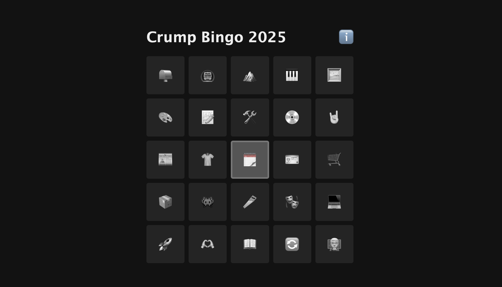

# Crump Bingo _(now with more 2025!)_

_A cute little HTML+CSS bingo board for things I think would be awesome to accomplish this year!_

Check it out in action at [crump.space/2025-bingo](https://crump.space/2025-bingo)! (or check out last year's [2024 bingo](https://crump.space/2024-bingo))

**Instead of making New Year's resolutions**, I made a bingo card of things I wanted to do in 2024. It was super fun, and a handful of friends and family joined in, so I'm keeping it going in **2025**! Some of these goals are lofty, some are silly or "trivial", and some just aren't fully in my control.

A **successful result 🎉** for me is that I can look back at the end of the year and celebrate the things I did do, but not feel guilty about the things that didn't happen.

---

🔎 **_Something fun to note about this page:_** there is zero javascript! The bingo card is made with CSS grid, and the modal card takes advantage of the `:target` CSS pseudo-class. This also means that you can link directly to this info card or to a specific square on the bingo card, like [this](https://crump.space/2025-bingo#modal13)!

🙏 JS-free modal adapted from [@sahil4test](https://codepen.io/sahil4test/pen/xERYvX)

🐙 Source code available [on GitHub](https://github.com/tylercrumpton/crump-bingo)
(or you can right-click and view-source!)

Made with ❤️ by [Tyler Crumpton](https://crump.space)
